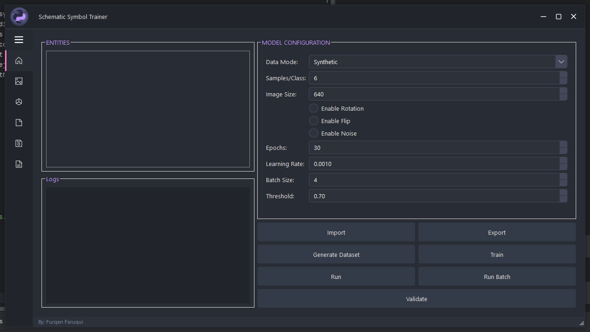
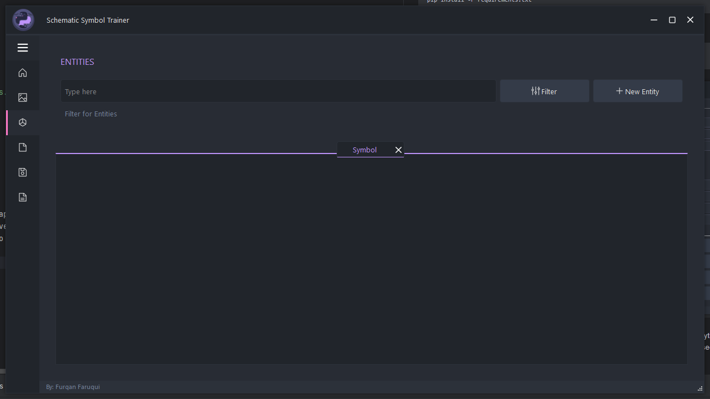
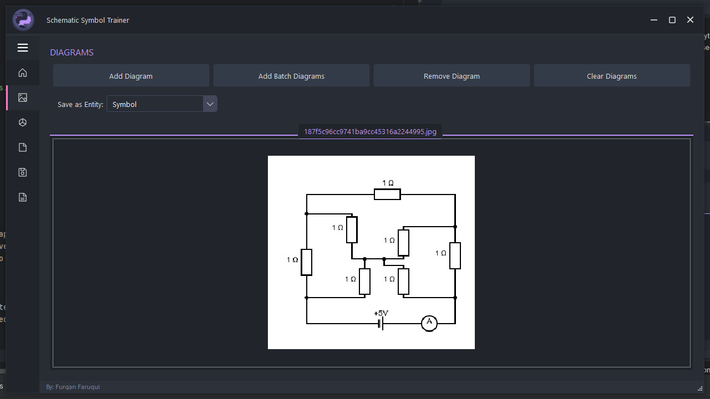
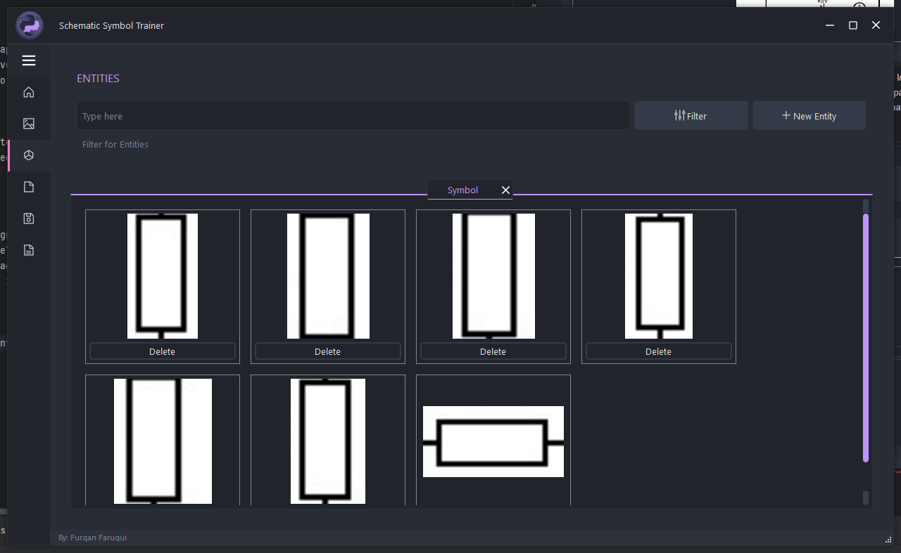
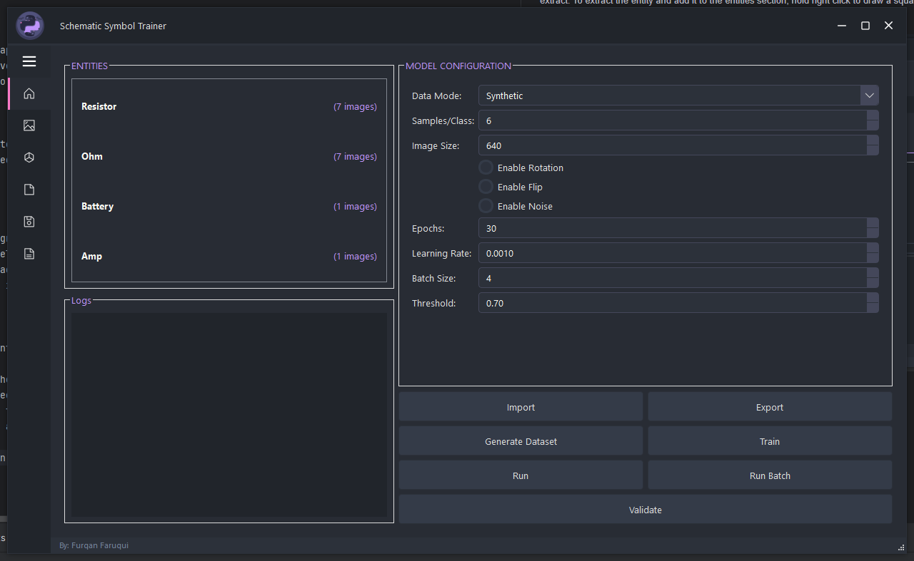
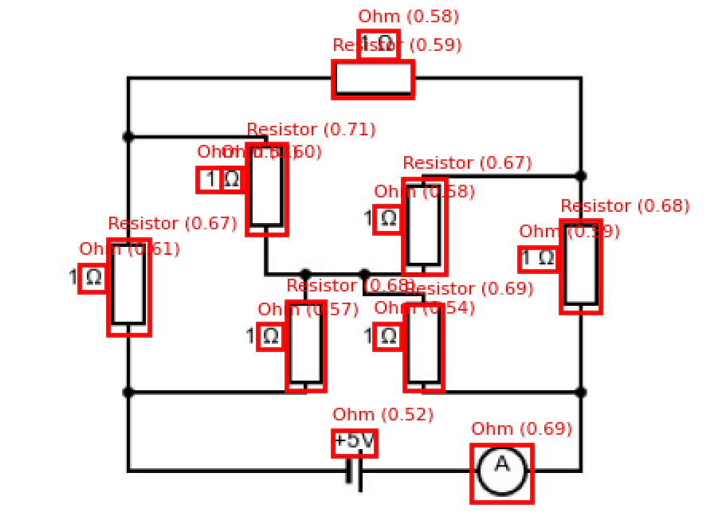

# Schematic Symbol Trainer
# 

A desktop application designed to train, validate, and improve object detection models for detecting reusable schematic symbols (like electrical components, technical shapes, etc.) from scanned or digital diagrams.

This tool offers a full pipeline from collecting symbol samples, training a model, validating detection results, and exporting usable models or datasets.

# Features

* Add and manage reusable symbols via entity managers
* Load single or multiple diagrams
* Create synthetic datasets from entity examples
* Full control over model configuration (e.g. image size, epochs, learning rate)
* Train and validate object detection models
* Visual symbol approval/rejection to refine training
* Export trained model (.pth) and detection results (image + CSV)

# Getting Started
## Requirements
* Python 3.10+
* PySide6
* OpenCV
* PyTorch
* Torchvision
* NumPy

Install with:

```console
pip install -r requirements.txt
```

Launch the app:

```console
python main.py
```

# The Home Page


When you first launch the application, you are met with the home page. This controls everything to do with manipulating
the model and provided a overview of the registered entities that have been parsed. At the start the section is no too useful
and the user should move to the entities page. It is easier to locate after selecting the burger bar at the top.

# The Entities Table

Here the user has can create new instances of symbol types to find in diagrams. This is done through selecting "new entity"
and the tab should get added as an option on the widget. The entity manager can also be removed by selecting the cross on 
the tab.

# The Diagram Page

Here the user can load diagrams to extract entities to better define what the model should look for. To do this, select the 
"Add Diagram" option and select and image of a diagram. Then using the scroll and mouse for panning on the image, locate the
entity to extract. To extract the entity and add it to the entities section, hold right click to draw a square *WHILE* the 
"Save as Entity" combo box is displaying the entity type to store it as.



This is what a populated entity table looks like.

The remaining options in the diagrams page are:
* Add Batch Diagrams - Select a folder to import all images that exist in the directory
* Remove Diagram - Removed the currently selected diagrams
* Clear Diagrams - Removes all diagrams from the tab widget

After all symbols have been parsed, the home page will be a bit more populated.



At this point, the user is ready to create and train a model! To start, confirm you are happy with the configuration of the 
Data Mode, Sample / Class, Image Size and the points to augment symbols to run against.
Next generate the dataset. This will use the entities in the managers to create augmented data to train against as the dataset
size will always be small.

Once the dataset has been generated, the model can be trained and the configuration is modified by the final four optionals
in the tab. The progress is dynamically output in the logs section. 

At this point the user can select run / run batch to detect entities inside an image / images and after selecting the diagram to 
process, the results are exported as an image and a csv with the detections found above the threshold.


An example where the dataset was small (about 17 images) and results.

# Importing and Exporting

The software has been designed to import and export the database and the created model. Samples have been provided
for this single diagram for initial testing.


